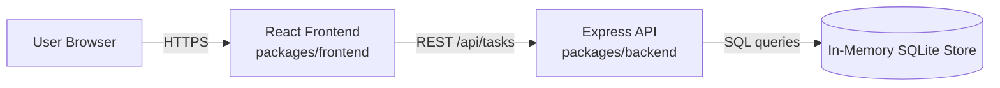
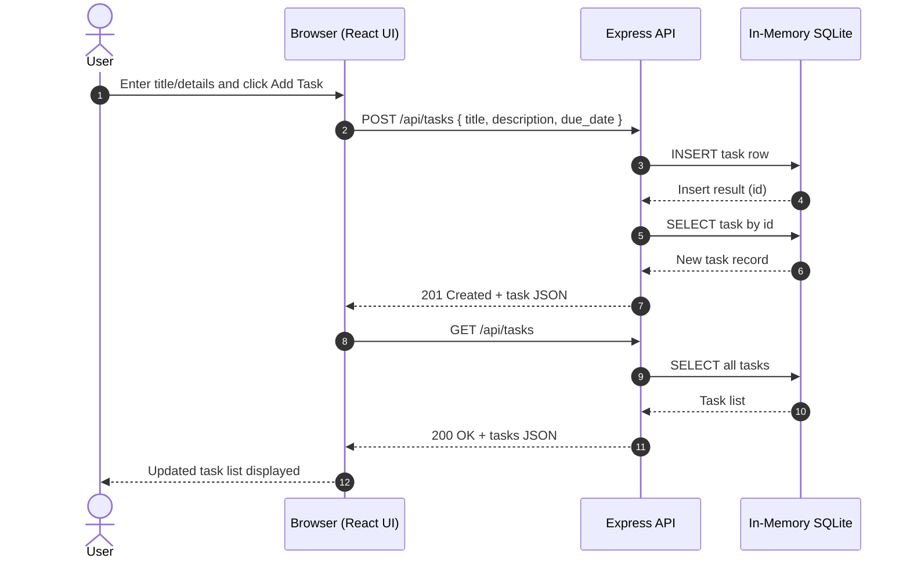

# Cloud Architecture Overview

This document provides a simple system context view of the TODO app monorepo.

## System Context

## Sequence: Create TODO

## Notes

- The React frontend is the user-facing application.
- The Express API exposes task endpoints consumed by the frontend.
- Data is stored in an in-memory SQLite database, so data resets when the backend process restarts.
